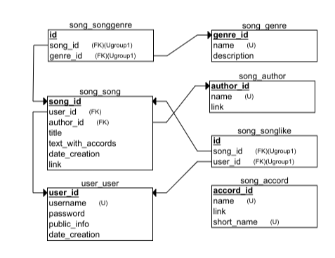

<h1> Back-end for app gitaristi. </h1>
<h2> Group 3 students of Coinis Developers Lab. </h2>
 

<h3> Relational schema from <a href="erdplus.com">erdplus.com</a> </h3>
 

<h3> Two back-end parts </h3>
    <ul>
        <li> user part (all about authentication etc.)</li>
         
        <li> song part (all about songs etc.)</li>
    </ul>

<h3> Back-end team members </h3>
    <ul>
        <li> Andrei Osetrov </li>
         
        <li> Nemanja Lakicevic </li>
    </ul>
