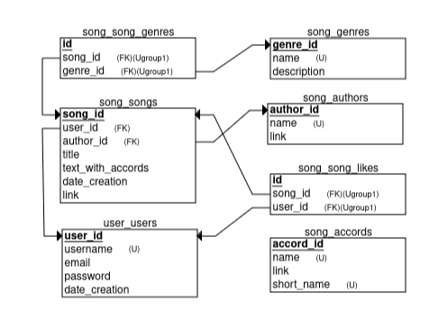

<h1> Back-end for app gitaristi. </h1>
<h2> Group 3 students of Coinis Developers Lab. </h2>
 

<h3> Installation </h3>
 

    > gh repo clone andreydmitr20/gitarista_back_g3_coinis
    > cd gitarista_back_g3_coinis
    > python3 -m venv venv
    > source venv/bin/activate
    > cd django
    > pip3 install -r requirements.txt
    > python3 m migrate
    > python3 m loaddata /data/data<last_version>.json
    > python3 m runserver

    You have got api :
    http://127.0.0.1:8000/api-auth/
    http://127.0.0.1:8000/song/

    Note that it is for back-enders only:
    http://127.0.0.1:8000/admin/

<h3> Relational schema from <a href="erdplus.com">erdplus.com</a> </h3>
 

<h3> Two back-end parts </h3>
    <ul>
        <li> user part (all about authentication etc.)</li>
         
        <li> song part (all about songs etc.)</li>
    </ul>

<h3> Back-end team members </h3>
    <ul>
        <li> Andrei Osetrov </li>
         
        <li> Nemanja Lakicevic </li>
    </ul>
